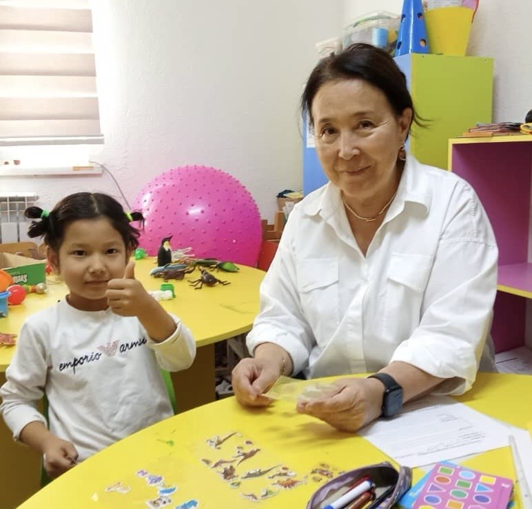

<!DOCTYPE html>
<html lang="ru">
<head>
<meta charset="UTF-8">
<title>Айгуль Байдылдаевна - Логопед-дефектолог</title>

</head>
<body>

<h1>Айгуль Байдылдаевна</h1>

Логопед-дефектолог

Телефон: <a href="tel:+996700702389">+996 700 702 389</a>

</body>
</html>
